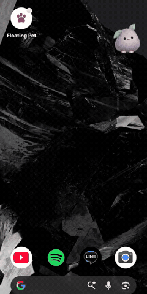
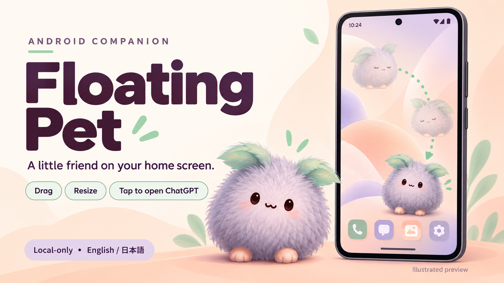
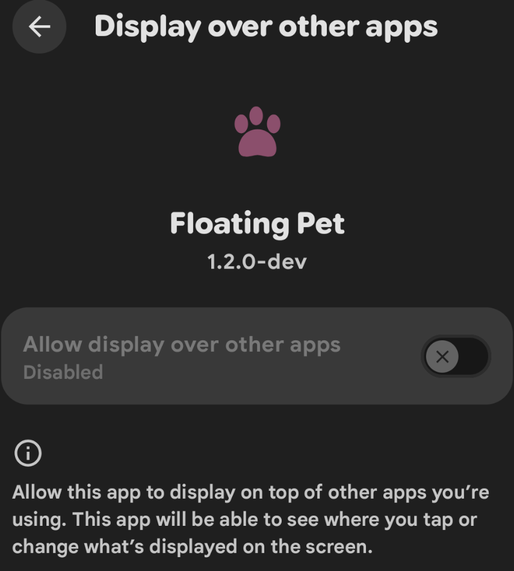
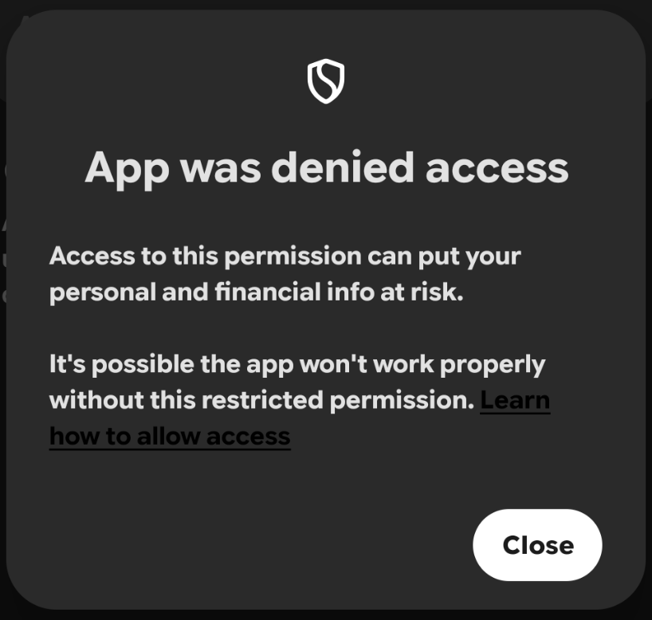
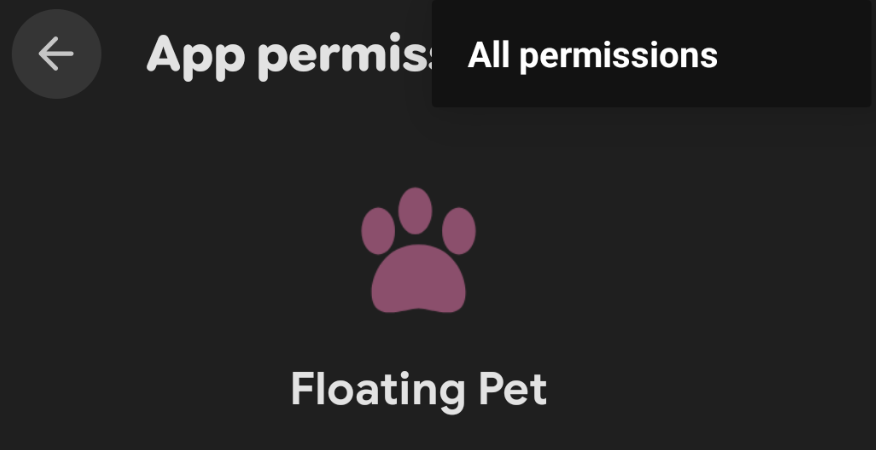
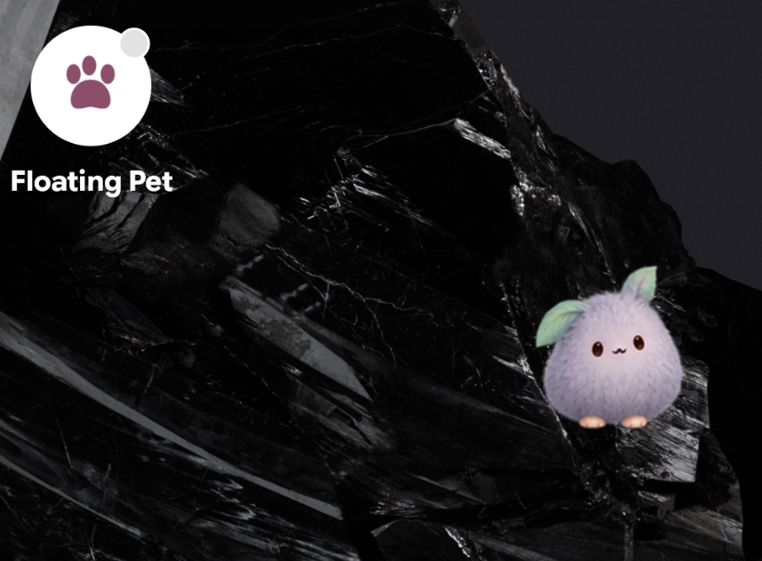

# Floating Pet for Android

<p align="right"><strong>English</strong> | <a href="README.ja.md">日本語</a></p>

**A Cute Floating Pet for Your Android Home Screen.**

Bring Mofu to your detected Android home screen: drag your companion, choose its size, or import a compatible transparent PNG sprite sheet.

**[Download development APK (Android 8.0+)](https://github.com/Kohei-SAWADA/floating-pet-android/releases/download/v1.2.0-dev/Floating-Pet-1.2.0-dev-English-default-debug.apk)** · [Development release](https://github.com/Kohei-SAWADA/floating-pet-android/releases/tag/v1.2.0-dev) · [Permissions and installation](docs/INSTALL.md) · [View demo](#demo)

This is a debug-signed development preview, not a stable or Play Store release. Android 8.0 / API 26+ and Android display-over-other-apps / Usage Access setup are required.

## Demo

[Watch the real Android demo (MP4, 23 seconds, silent)](assets/promo/floating-pet-demo.mp4)



Edited from user-supplied device recordings: Mofu on the home screen, dragging, and the size control. Notification panels and private app content are excluded; the optional ChatGPT shortcut is not demonstrated. The existing [Mofu home-screen example](docs/screenshots/home-screen-mofu.png) is also a real-device capture. The hero below remains an illustrated preview.

## Main features

- Draggable floating Mofu, 48–240 dp size controls, and compatible local sprite import.
- Gentle idle animation and directional poses while dragging.
- Optional tap shortcut to the separately installed official ChatGPT Android app.
- Local-only operation with no Internet permission; home detection has device-dependent limits.

[Full features](#at-a-glance) · [Permissions and privacy](#permissions-and-privacy) · [License status](LICENSE-STATUS.md)

<p align="center"></p>

<p align="center"><strong>A little friend on your home screen.</strong><br>Drag it. Make it your size. Tap to open ChatGPT.</p>

Floating Pet is a small, local-only Android companion. It shows a calm, draggable pet when your default home launcher is detected. Use the included **Mofu** sample, or import a compatible transparent PNG sprite sheet of your own.

**Development preview: 1.2.0-dev.** The source and **debug-signed development APK** are publicly available. This is not a stable, production-signed, or Play Store release. Download the APK through [GitHub development releases](https://github.com/Kohei-SAWADA/floating-pet-android/releases/tag/v1.2.0-dev); see [installation instructions](docs/INSTALL.md), [Verification](VERIFICATION.md), and the [release checklist](docs/RELEASE_CHECKLIST.md). Android **8.0 / API 26 or newer** is required.

The hero is an **illustrated preview**, not a device screenshot. Cropped real-device setup and successful Mofu-display screenshots are included below. See the [capture guide](docs/SCREENSHOTS.md) for additional examples.

This is an independent project, not affiliated with, endorsed by, or sponsored by OpenAI. ChatGPT is mentioned only to explain the optional app-opening shortcut. The sample pet is a newly generated original design, not an official OpenAI character; see [asset provenance](docs/ASSET_PROVENANCE.md).

## At a glance

- A small companion over the detected home screen, with conservative hiding when home cannot be confirmed
- Drag to move; choose a width from **48–240 dp**; saved position follows screen size
- Gentle breathing while idle, brief touch response, and directional poses while dragging
- Tap to launch the installed official ChatGPT Android app; no account or API key needed in Floating Pet
- English on first launch, with English / 日本語 / device-language buttons; Android 13+ also synchronizes per-app language settings
- Bundled Mofu sample and local import of exact v1/v2 transparent PNG atlases
- Notification controls to hide, show, or stop; no automatic start after reboot
- No network permission, analytics, ads, account system, or runtime third-party libraries

## Get started

### Download or build and install

Download [`Floating-Pet-1.2.0-dev-English-default-debug.apk`](https://github.com/Kohei-SAWADA/floating-pet-android/releases/download/v1.2.0-dev/Floating-Pet-1.2.0-dev-English-default-debug.apk) from [GitHub development releases](https://github.com/Kohei-SAWADA/floating-pet-android/releases/tag/v1.2.0-dev), or build a debug APK using the instructions below. Follow the [installation guide](docs/INSTALL.md), including the warning about differently signed older installations. Only install APKs from a source you trust. This debug build is for testing, not a stable or production release.

### Choose your language

This build opens in English on first launch, including on a Japanese-language phone. At the top of the settings screen, choose **English**, **日本語**, or **Use device language**. Changing language stops the current pet; tap **Show pet** afterwards. On Android 13+, the same choice is reflected in Android Settings → Apps → Floating Pet → Language. Older supported Android versions use the in-app buttons. An existing language selected in Android Settings is respected.

## First launch

1. Open **Floating Pet** and select **Use sample pet**, or **Choose spritesheet.png** for your own artwork.
2. Open **Open Android display permission** and allow Floating Pet to display over other apps.
3. Open **Set up usage access** and enable access for Floating Pet. This is used to detect the default home launcher. Usage events are processed only in memory on your device.
4. Optionally allow notifications, so you can use the notification's hide/show/stop controls.
5. Adjust the size, then tap **Show pet** and return Home. If it does not appear, open another app and return Home again.
6. Drag the pet to move it. Tap to open ChatGPT. Use **Stop pet** in the settings screen whenever you want to stop it.

Grant permissions only if you are comfortable with the scope described under [Privacy](PRIVACY.md). The app never grants them itself.

### “App was denied access” / the display switch is disabled

The following real-device example shows the problem, a common wrong turn, and the successful result. The screenshots were supplied by the user and cropped without changing their text or pixels.

**What you may see**

<p align="center">
  
  
</p>

Only continue for an APK/developer you trust and a permission risk you accept. Keep Play Protect enabled. Google's [restricted-settings guide](https://support.google.com/android/answer/12623953?hl=en) gives the app-specific route:

1. **Go to App info.** Close the warning. Open Android **Settings → Apps → See all apps → Floating Pet**. Stay on the **App info** parent screen.
2. **Check the screen title.** If you opened **App permissions**, go back once; from **All permissions**, go back twice. The menu below only opens All permissions because it belongs to the wrong level. **Manage app if unused** does not need changing.

<p align="center">
  
  <br><em>This is the App permissions subpage. Return to its App info parent.</em>
</p>

3. **Approve only this trusted app.** On **App info**, choose **⋮ / More → Allow restricted settings** and complete any on-device identity check. Do not send your PIN/password to anyone.
4. **Return and enable the display permission.** Open **Display over other apps → Floating Pet** and turn it on. Then return to Floating Pet, finish **Set up usage access** if needed, tap **Show pet**, and go Home. Removing the restriction alone does not turn on the overlay switch.

**Result on the reporting user's phone**

<p align="center">
  
  <br><em>The home-screen screenshot.
</em>
</p>

This confirms one user's successful display of Mofu, not testing across all phones or every interaction. The App info menu itself was not captured; the numbered route follows Google's guide. Device model and Android version were not confirmed.

**Still missing the menu?** Reopen App info after closing the warning; follow its **Learn how to allow access** link. Android's [confirmation-flow documentation](https://android.googlesource.com/platform/prebuilts/fullsdk/sources/+/refs/heads/androidx-constraintlayout-release/android-35/android/app/ecm/EnhancedConfirmationManager.java) explains why the warning may need to appear first. If still blocked, record the phone model/Android version and consult the administrator on managed devices. Avoid forced ADB grants, device-wide protection changes, or repeated reinstalls. Allowing restricted settings can expose other protected settings for that app, so grant only what you need.

### Try the same sample on an existing installation

The bundled file is [Mofu's spritesheet.png](app/src/main/assets/pets/mofu/spritesheet.png). Download the **raw PNG**, keep its original pixel dimensions, and choose it in the app's existing file picker. It uses the v1 layout already supported by 1.1.3; no new APK is needed just to try the art. Do not save the thumbnail or a screenshot of the sheet.

The new **Use sample pet** button requires a build of this source package. Replacing an imported image stops the current overlay; tap **Show pet** to restart with the new image. Failed or cancelled imports keep the previous image.

## Permissions and privacy


| Access                  | Why it is used                                    | Control                                  |
| ----------------------- | ------------------------------------------------- | ---------------------------------------- |
| Display over other apps | Draw the draggable pet                            | Android overlay settings                 |
| Usage Access            | Check whether the default home launcher is active | Android Usage Access settings            |
| Foreground service      | Keep the explicitly started pet running           | Persistent notification and Stop button  |
| Notifications           | Provide hide/show/stop controls                   | Android notification permission/settings |

No Internet, storage-read, accessibility, microphone, camera, location, or contacts permission is requested. Your selected PNG is copied into app-private storage. Preferences store only the pet's size, position, and behavior settings. Usage history is not saved or uploaded. Opening ChatGPT leaves this app; ChatGPT's own privacy terms then apply.

[Privacy details](PRIVACY.md) · [Security](SECURITY.md)

## Home detection and battery limits

Home detection uses Android usage events, which are delayed evidence rather than an instantaneous foreground-window API. **Strict home-only visibility is not guaranteed.** The pet can briefly remain during app transitions. Recents or an app drawer within the launcher package may be indistinguishable from Home. Split screen, picture-in-picture, late events, and manufacturer background policies need device testing.

**Response priority** targets a 200 ms start-to-start polling interval while the screen is on and unlocked. Turn it off for 500 ms economy mode. Response priority permits up to 2.5× the query frequency; this is not a claim about battery drain. Slow or failed queries back off. Screen-off stops recurring usage polling. Manual hide and Stop always win over home detection.

Animations respect the app setting, Android animation settings, and battery saver. Idle rendering is capped at 25 fps while visible. The app does not bypass Android's protected-screen or overlay restrictions. For fuller behavior details, see [architecture](docs/ARCHITECTURE.md).

## Bring your own pet


| Layout | Exact PNG size  | Grid                 | Used frames |
| ------ | --------------- | -------------------- | ----------- |
| v1     | 1536 × 1872 px | 8 columns × 9 rows  | 57          |
| v2     | 1536 × 2288 px | 8 columns × 11 rows | 73          |

- Each cell is **192 × 208 px**, transparent background, at most **12 MiB** per PNG
- Shared rows: idle, running-right, running-left, waving, jumping, failed, waiting, running, review
- v1 frame counts: **6, 8, 8, 4, 5, 8, 6, 6, 6**
- v2 adds two eight-frame directional-look rows
- The calm interaction controller uses the first five rows; the remaining rows are compatible artwork, not additional app features
- Arbitrary-sized sheets, JPEG files, and standalone avatar images are not supported
- Import validates file signature, dimensions, decodability, alpha support, and size before atomically replacing the current image

[Full sprite contract](docs/SPRITES.md) · [Mofu provenance](docs/ASSET_PROVENANCE.md)

## Build from source

Requirements: **JDK 17 or 21**, Android SDK **platform 35** and **Build Tools 35.0.0**, and the project's Gradle wrapper. Review and accept [Google's Android SDK terms](https://developer.android.com/studio/terms) when installing the SDK.

Set `ANDROID_HOME` or copy `local.properties.example` to the untracked `local.properties` and set your SDK path.

```sh
chmod +x gradlew
./gradlew --no-daemon --max-workers=1 assembleDebug testDebugUnitTest lintDebug
```

On Windows, use `gradlew.bat` in place of `./gradlew`.

- Debug APK: `app/build/outputs/apk/debug/app-debug.apk`
- Unit test report: `app/build/reports/tests/testDebugUnitTest/index.html`
- Lint report: `app/build/reports/lint-results-debug.html`
- Local source/package checks: `python3 scripts/check_repository.py`

Pinned versions are Gradle **8.13**, Android Gradle Plugin **8.9.2**, and JUnit **4.13.2**. Gradle's distribution checksum is pinned; the included wrapper JAR matches the [official Gradle checksum](https://gradle.org/release-checksums/). Build dependencies come from Google Maven, Maven Central, and the Gradle Plugin Portal.

The app retains the original `com.dot.floatingpet` application ID for source compatibility. This does not establish brand ownership. A locally built debug APK may use a different development certificate from a previous APK. Android will reject an in-place update when certificates differ; uninstalling first removes saved settings and imported art. No private signing key is included. Plan production identity and signing before a stable or production release.

## Repository map

```text
app/src/main/             Android source, English/Japanese resources, sample pet
app/src/test/             Android-independent controller unit tests
docs/assets/              README hero (illustrated preview)
docs/screenshots/         Cropped permission screenshots and capture notes
docs/                     Setup, sprite contract, privacy and release guidance
scripts/                  Offline repository/asset checks
benchmarks/               Synthetic polling benchmark, not battery measurements
```

## Verification and publication

Read [VERIFICATION.md](VERIFICATION.md) for what was actually checked on this revision. The original 1.1.3 verification record is retained separately and does not establish that this modified revision passed a build or device test.

The owner has authorized publication of this development preview without selecting a general source-code or artwork license. Public availability is not a general reuse or redistribution license grant. Remaining work for a stable/production release includes license decisions, artwork/provenance review, broader Android device testing, additional screenshots, and production signing/package identity. See [License status](LICENSE-STATUS.md), [third-party notices](THIRD_PARTY_NOTICES.md), and [Contributing](CONTRIBUTING.md).
